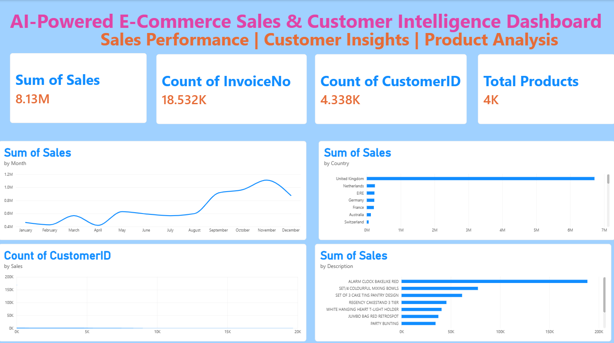

# AI-Powered E-Commerce Sales & Customer Intelligence

**Python | Pandas | MySQL | SQL | Power BI | Excel**

## Project Overview

This project analyzes e-commerce sales data to understand sales performance, customer behavior, product performance, and country-wise sales.

The project combines Python for data cleaning and analysis, MySQL and SQL for database analysis, and Power BI for interactive data visualization.

## Key Metrics

| Metric       | Value |
| ------------ | ----: |
| Total Sales  | 8.13M |
| Total Orders | 18.5K |
| Customers    |  4.3K |
| Products     | 3.6K+ |
| Countries    |    37 |

## Dashboard



## Project Workflow

1. **Data Preparation** — Cleaned and prepared the e-commerce dataset using Python and Pandas.
2. **Data Analysis** — Created analytical datasets for monthly, customer, country, and product analysis.
3. **SQL Analysis** — Imported cleaned data into MySQL and performed SQL queries for business analysis.
4. **Power BI Visualization** — Created an interactive dashboard to analyze sales performance, customers, products, and countries.

## Technologies Used

* Python
* Pandas
* MySQL
* SQL
* Power BI
* Excel
* GitHub

## Project Structure

```text
Ecommerce-Sales-Intelligence
│
├── 01_Raw_Data
├── 02_Clean_Data
├── 03_Python
├── Ecommerce_Sales_Intelligence_Dashboard.png
├── index.html
├── style.css
└── README.md
```

## Live Project

[View the E-Commerce Sales Intelligence Website](https://challagundlamahendrauthej7032-creator.github.io/Ecommerce-Sales-Intelligence/)

## Project Highlights

* Cleaned and analyzed more than 397,000 e-commerce transaction records.
* Built SQL-based business analysis using MySQL.
* Developed a Power BI dashboard for sales and customer insights.
* Created a responsive project website using HTML and CSS.
